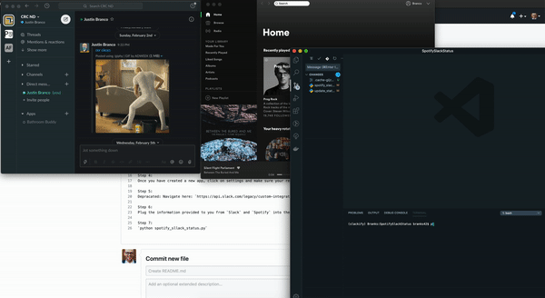

# SpotifySlackStatus
Update your Slack status based on the song you're currently listening to on Spotify

Step 1:
Set up an environment and `pip install` the libraries in the requirements.txt file.

Step 2:
Log in to Spotify and head here: https://developer.spotify.com/dashboard/applications/

Step 3: 
Set up a new app....

Step 4:
Once you have created a new app, click on settings and make sure your redirect uri is set to `http://localhost:9090`

Step 5:
Depracated: Navigate here: https://api.slack.com/legacy/custom-integrations/legacy-tokens and grab a Legacy Slack token.

Step 6:
Plug the information provided to you from `Slack` and `Spotify` into the blanks in the code.

Step 7:
`python spotify_slack_status.py`
